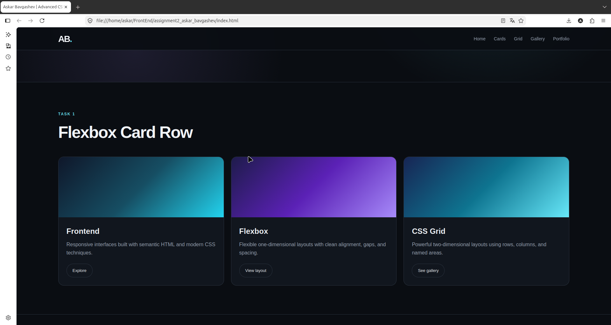
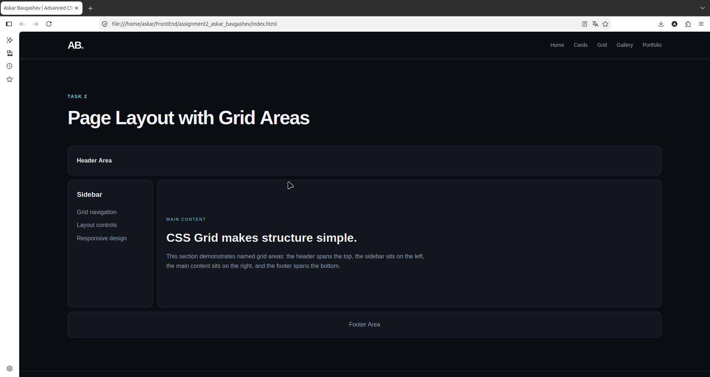
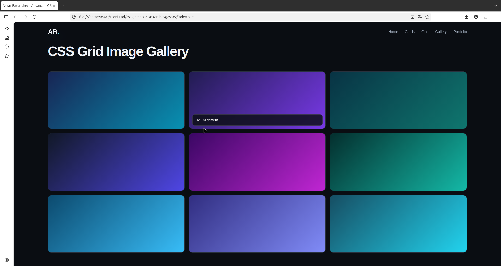
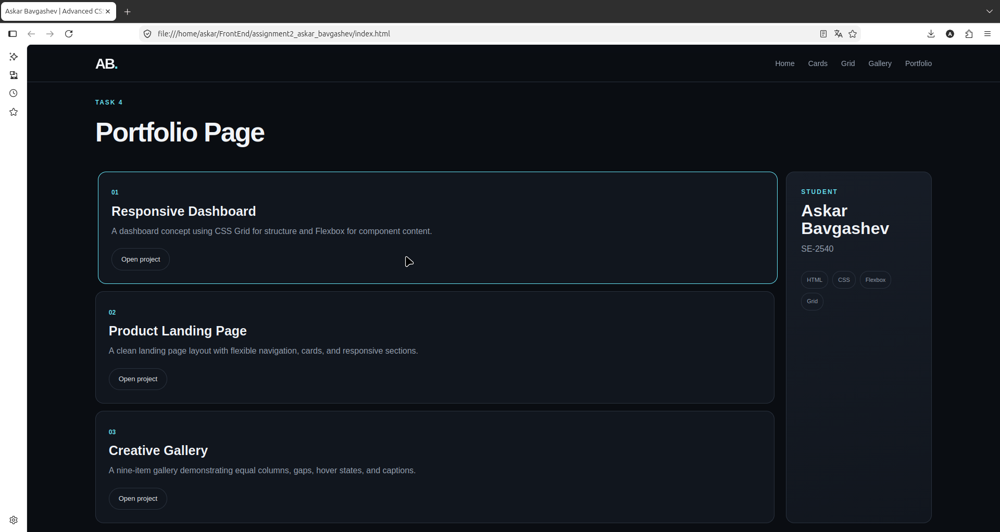

# Assignment #2 — Advanced CSS (Flexbox & Grid)

**Student:** Askar Bavgashev  
**Group:** SE-2540

## Objective

The purpose of this assignment is to practice modern CSS layout techniques using **Flexbox** and **CSS Grid**. The project demonstrates responsive layouts, alignment, spacing, equal-height cards, grid areas, an image gallery, and a portfolio layout combining Flexbox and Grid.

## Technologies

- HTML5
- CSS3
- Flexbox
- CSS Grid
- Responsive CSS

## Part 1 — Flexbox

### Task 0 — Navigation Bar

The navigation header uses Flexbox to place the logo on the left and navigation links on the right. The items are aligned horizontally and vertically with consistent spacing.


### Task 1 — Card Row

Three cards are arranged in a horizontal Flexbox row. Each card contains a visual area, title, description, and button. The cards have equal heights, consistent spacing, and a hover effect.



## Part 2 — CSS Grid

### Task 2 — Page Layout with Grid Areas

The page layout uses CSS Grid with named areas for the header, sidebar, main content, and footer. The sidebar is positioned on the left, the main content on the right, and the footer spans the bottom.



### Task 3 — Image Gallery

The gallery uses CSS Grid with three equal-width columns and consistent gaps. It contains nine gallery items and demonstrates a hover caption overlay.



## Part 3 — Combining Flexbox & Grid

### Task 4 — Portfolio Page

The portfolio section combines CSS Grid and Flexbox. The main area contains project cards while the student information is placed in a sidebar. The project content uses Flexbox for alignment and spacing.



## Work Process Summary

The project was developed by first creating the HTML structure for each required task and then applying CSS layouts with Flexbox and Grid. Flexbox was used for the navigation bar and card content, while CSS Grid was used for the page layout, gallery, and portfolio structure. Responsive rules were added to keep the layouts usable on smaller screens. Hover states were also implemented for interactive visual feedback.

## Project Structure

```text
assignment2-advanced-css/
├── index.html
├── style.css
├── README.md
└── screenshots/
    ├── task0-navigation.png
    ├── task1-cards.png
    ├── task2-grid-layout.png
    ├── task3-gallery.png
    └── task4-portfolio.png
```

## Conclusion

This project demonstrates the use of modern CSS layout techniques without external layout frameworks. It combines Flexbox and CSS Grid to create structured, responsive, and consistently styled page sections.
